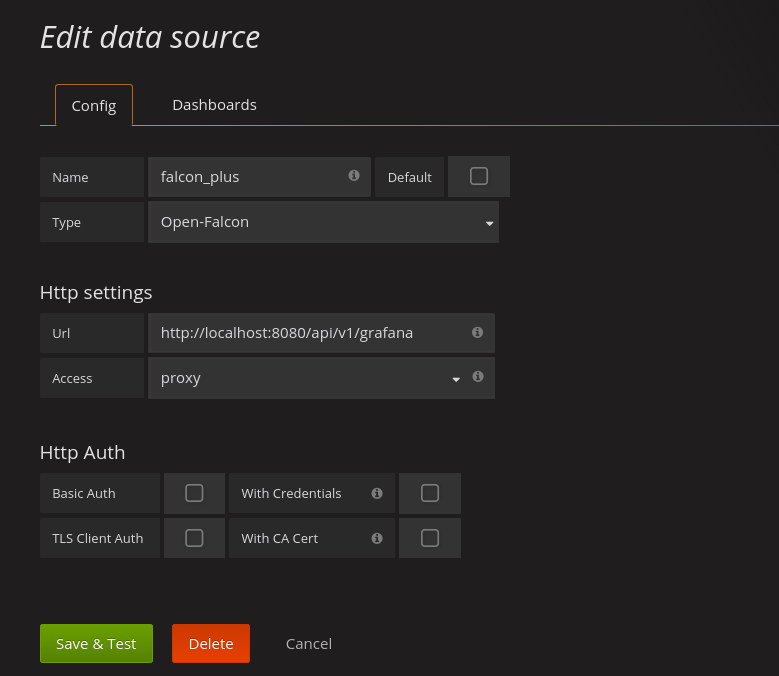

# Open-Falcon plugin for Grafana

[Open-Falcon](https://github.com/open-falcon/open-falcon) is an open-source, enterprise-level, and large-scale service monitoring system and time series database. It's initially released by Xiaomi SRE team in 2015 and heavily used in Xiaomi. Open-Falcon is now one of the most popular monitoring system in China internet companies:

- www.mi.com
- www.meituan.com
- www.Xunlei.com
- www.Baidu.com
- www.ksyun.com
- www.douban.com
- www.fastweb.com.cn
- www.ganji.com
- www.upyun.com
- www.xiaojukeji.com
- www.iqiyi.com

More Info:

- Full company list: https://github.com/XiaoMi/open-falcon/issues/4
- Release: https://github.com/open-falcon/of-release
- Documentation: http://book.open-falcon.org

## Installation


### Download prebuild version of grafana official site
(https://grafana.com/grafana/download) `Grafana v4.2`

#### Checkout the plugin
```
cd {GRAFANA_PATH_Installed}/data/plugins
git clone https://github.com/Cepave/grafana-openfalcon-datasource
```

### Start grafana-server
```
{GRAFANA_PATH_Installed}/bin/grafana-server
```

## After Installation
If the installation is successful, Open-Falcon datasource would be shown as follow:


## How to Set up datasource
* the backend services is provide by [falcon-plus](https://github.com/open-falcon/falcon-plus/tree/master/modules/api).


